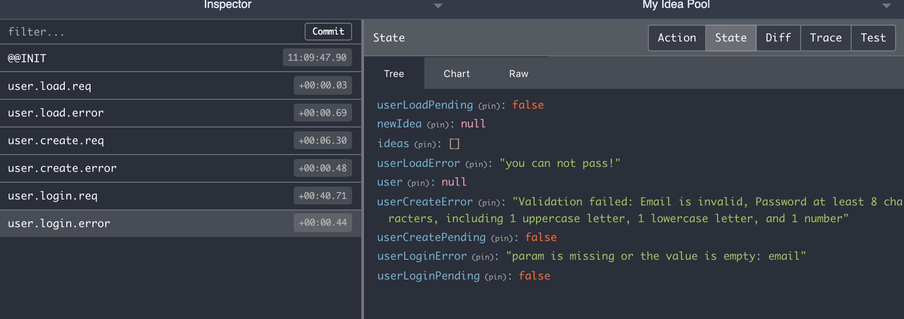

# Red(ux) Req(uest Helpers and Whatnot)

[](https://travis-ci.org/reergymerej/redreq)

When performing AJAX calls with Redux, you typically want three actions.

* start the request
* it was ok
* it failed

You'll typically want to keep track of some state for these things too.

* the request is pending
* the entity that was fetched
* the request is complete
* the error

And you probably want little action factories you can use so actions are always
created the same way.

This package will help generate these for your with almost no effort.


## Usage


### Define your entities (objects and verbs)

```js
import redreq from 'redreq'

// These are the entities we will request.
const requests = redreq([
  [ 'idea', 'create' ],
  [ 'idea', 'delete' ],
  [ 'idea', 'update' ],
  [ 'ideas', 'list' ],
  [ 'user', 'create' ],
  [ 'user', 'load' ],
  [ 'user', 'login' ],
  [ 'user', 'logout' ],
])

export { requests }
export default {
  ...requests.factories,

  // These are actions factories for things that happen without ajax requests.
  ideaRemoveById: (id) => ({ type: 'ideaRemoveById', id }),
  setEditMode: (id) => ({ type: 'setEditMode', id }),
}
```


### Add the Reducer

```js
import { requests } from './action-factories'

export default (state = initialState, action) => {
  // the generated reducers are tied in here
  state = requests.reducer(state, action)

  switch (action.type) {
  // your regular reducers can stay here

  case 'ideaRemoveById':
    return {
      ...state,
      ideas: remove(state.ideas, {id: action.id}),
    }

  case 'setEditMode':
    return {
      ...state,
      editing: action.id,
    }

  // non-standard requests
  // If you need to do additional stuff for your generated actions, you can!
  case requests.action.type.user.logout.success:
    return {
      ...state,
      editing: null,
      ideas: [],
      newIdea: null,
      user: null,
    }

  // We can use the handy-dandy dot-notation to access our action types.
  case requests.action.type.idea.update.success:
    return {
      ...state,
      ideas: replace(state.ideas, action.idea),
    }

  default:
    return state
  }
}
```

### Use the Action Factories

```js
import actions from './action-factories'

export const createIdea = (rawIdea) => {
  return (dispatch) => {
    // refer to your action factories by dot-notation, too
    dispatch(actions.idea.create.req())
    return service.createIdea(rawIdea)
      .then((idea) => {
        dispatch(actions.idea.create.success(idea))
      })
      .catch((err) => {
        dispatch(actions.idea.create.failure(err.message))
      })
  }
}
```


